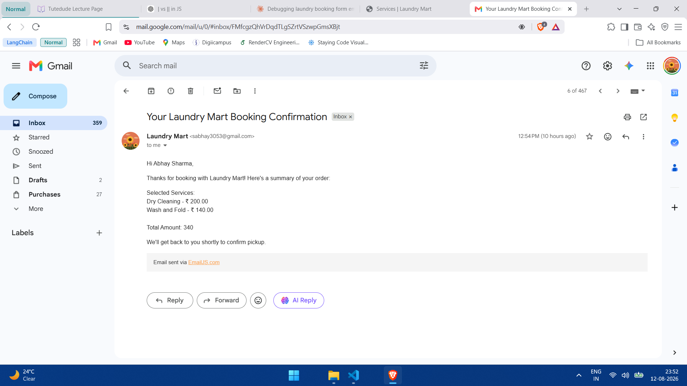
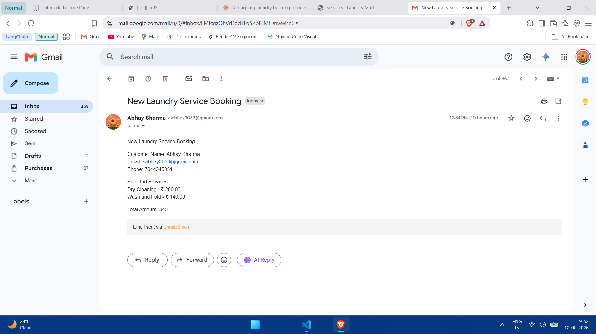

# Laundry Mart - Service Booking

A simple laundry service booking website to practice JavaScript DOM manipulation, arrays, and event handling. Users can add or remove services from the cart, view the total, and book — with confirmation emails sent via EmailJS.

[Laundry Mart - GitHub Repo](https://github.com/abhay-dot-dev/Laundry-Mart)

## What Learnt

* Understood how JavaScript can access and manipulate HTML elements dynamically using DOM methods like `getElementById()` and `querySelector()`. 
* Learned how to use `addEventListener()` to perform actions when buttons and form inputs are clicked.
* Learned how to use an array as a cart to store the selected laundry services. 
* Used `for...of` loops and `entries()` to go through the cart and display the selected services dynamically. 
* Learned how to use `push()`, `findIndex()`, and `splice()` to add and remove services from the cart.  
* Learned how to calculate the total amount by iterating through the cart and converting the service prices into numbers using `parseFloat()`. 
* Learned how `parentElement` and `querySelector()` can be used together to access elements inside a particular service item. 
* Learned how `classList` can be used to change the state of elements, such as enabling and disabling the **Book Now** button. 
* Learned how to use hidden input fields to pass dynamically generated data (like cart services and total) through a form.
* Learned how to integrate `EmailJS` to send real-time emails using `emailjs.init("YOUR_PUBLIC_KEY")` and `emailjs.sendForm(SERVICE_ID, TEMPLATE_ID, FORM_DETAILS)`.
* Learned how to use EmailJS's `Auto-Reply` feature to send a second, separate confirmation email to the customer using the same form submission.

## Technologies Used

* HTML
* CSS
* JavaScript
* EmailJS
* Phosphor Icons
* Ionicons

## Folder Structure

```
ABHAY_TASK20/
├── .vercel/
├── images/
├── .gitignore
├── index.html
├── script.js
├── style.css
└── README.md
```

## Testing / Verification

### Email Confirmation
* With the use of EmailJS, real-time mail both to the owner and the customer was verified.
* One can visit the website, add items to the cart , fill in his/her details, and on clicking `Book Now` button, an actual mail will be sent to the customer in real-time.

**Customer confirmation email:**


**Owner notification email:**


## How to Run

1. Download or clone the project.
2. Open the project folder.
3. Open `index.html` in your browser.

OR

Use **Live Server** in VS Code.